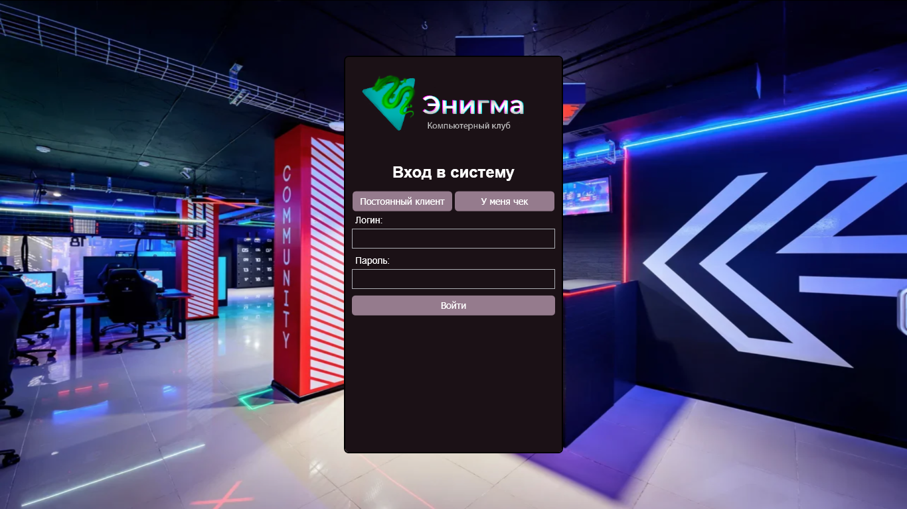
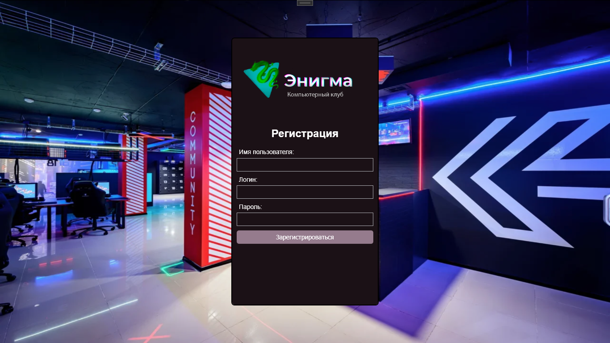
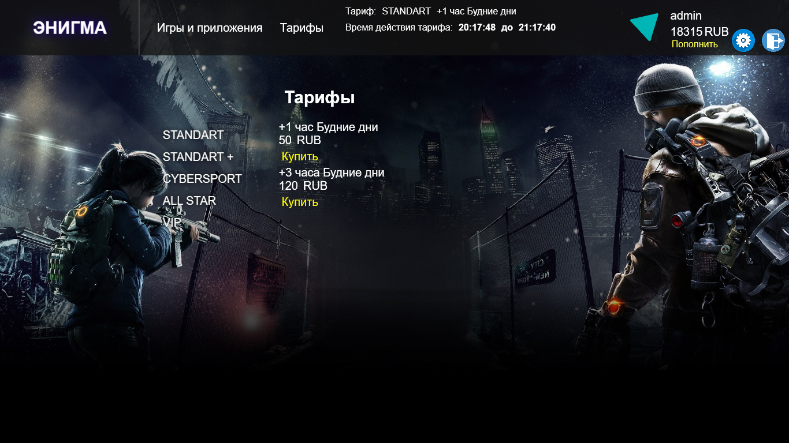
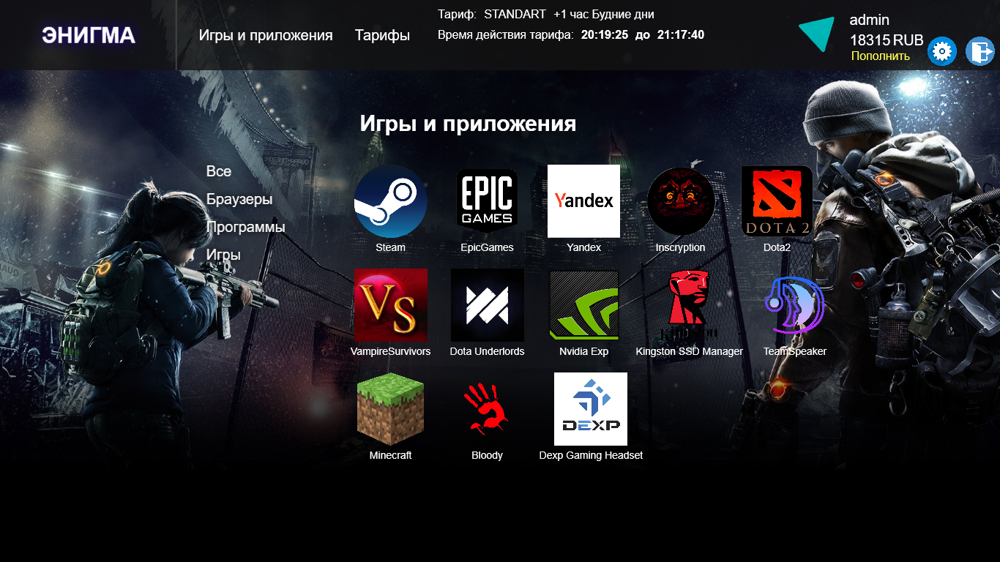

# EnigmaClient Version 1.2022
> [!WARNING]
> Приложение работает с системными настройками ОС Windows, во избежании нежелательных изменений в системе,
>  рекомендуется запускать проект на ***виртуальной машине***.
## Описание
EnigmaClientV1.2022 - CRM-проект, который является десктопным приложением,
упрощающий функционирование бизнес-процессов в компьютерном клубе.
Он обеспечивает безопасность для инфраструктуры и удобство для клиента.

Задачей проекта являлось изучение предметной области 
компьютерного клуба, разработка приложения,
которое ограничивает доступ пользователя к системным настройкам ОС
и предоставляет удобный интерфейс для запуска приложений.
> Это курсовой проект, который стал для меня ценным опытом, позволяющим применить и расширить мои теоретические знания на практике. В нем я реализовывал свои идеи, решал сложные задачи, попутно изучая новые аспекты профессии.

## Функционал

Пользователь

  
* Аутентификация и регистрация
* Пополнение лицевого счета и оплата услуг
* Изменение персональных данных
* Выход из аккаунта
* Запуск разрешенных приложений

Приложение

  
* Контроль времени использования компьютера
* Ограничение возможностей пользователя в ОС
* Отображение актульной информации по услугам

Администратор

  
* Отключение ограничений в ОС
* Генерация нового чека для регистрации
* Выход из приложения

## Инструкция
> [!IMPORTANT]
> Приложение следует запускать ***от имени администратора***, чтобы программа имела доступ к функциям ОС.

### Аутентификация

<picture> </picture>

После запуска приложения открывается окно аутентификации,
где пользователь вводит свой логин и пароль.
После успешной аутентификации, открывается [основное окно](readme.md#Основное окно).

### Регистрация
Если вы используете приложение впервые, вам потребуется регистрация.
Для регистрации нового пользователя необходимо ввести уникальную комбинацию символов - чек,
который выдается новому пользователю.
> Выглядеть он может следующим образом:
> * 3333333333
> * 1231231231
> * 0015841235

<picture> </picture>

Зная свой уникальный чек, пользователь вводит его и попадает в окно регистрации.
Здесь заполняются формы "Имя", "Логин" и "Пароль", после чего, при нажатии "Зарегестрироваться"
в базе данных создается новый пользователь, который теперь может [пройти аутентификацию](readme.md#Аутентификация).

Чтобы сгенерировать новый чек, в программе предусмотрен костыль разработчика, в котором можно:
* Сгенерировать новый чек
* Разбокировать диспетчер задач
* Закрыть приложение

> [!NOTE]
> Чтобы открыть панельку админа, необходимо в окне аутентификации в поле логин ввести "viktor", в поле пароль - "viktor".

### Основное окно
После успешной аутентификации пользователь попадает в основное рабочее окно.

<picture> </picture>

Если до этого шага пользователь не покупал тариф,
то вкладка "Игры и приложения" будут недоступны, пока не будет приобретен желаемый тариф.
Чтобы приобрести тариф, нужно пополнить счет, нажав кнопку "Пополнить".
После успешного пополнения следует выбрать тариф и нажать "Купить".
> [!NOTE]
> В данном проекте выводятся все тарифы, и это неверно.
> Сделано это лишь для демонстрации, какие тарифы существуют,
> специально для комиссии преподавателей на защите курсовой работы.
> В правильной реализации пользователю доступны только тарифы,
> которые соответствуют типу его ПК (STANDART, VIP и т.д).

После успешной транзакции, пользователь может активировать свой тариф, нажав "Активировать тариф".
После данной процедуры станет доступна кнопка "Игры и приложения".
С этого момента запускается таймер, 
по окончанию которого доступ к функционалу приложения приостановиться для пользователя.
Можно либо продлить старый тариф, либо приобрести новый.

Тарифы обновляются автоматически, в зависимости от времени суток.

<picture> </picture>

Пользователь может выбрать интересующее его приложение и нажать на него. Если оно было открыто ранее, всплывет окно выбранного приложения.
Иначе запустится новый процесс.

Программа перехватывает события Windows и отключает функции. 
Скрывает приложение из панели задач, отключает диспетчер задач, отключает файловое диалоговое окно в Yandex браузере.
Также отключает перечень системных комбинаций клавиш, такие как:
* Alt + Esc
* Alt + F4
* Ctrl + Esc
* Left Windows Key
* Right Windows Key
> [!TIP]
> Программа возвращает все изменения в Windows в состояние по умолчанию после завершения.

Сделано это все для того, чтобы пользователь не мог закрыть "песочницу" и не испортил состояние системных файлов.

## Технологии проекта
* С#
* WPF
* MS SQL
* MS SQL Server Managment Stutio
* LINQ, EntityFramework, WinAPI

## Будущее проекта
* Добавить полноценную административную панель/приложение
* Разместить базу данных на удаленном сервере
* Добавить кроссплатформенность
* Добавление систем оплаты
* Общее упрощение дизайна
* Создание сайта для бронирования компьютерных мест
* Добавление возможности для общения клиента с администрацией клуба при помощи приложения

## Ссылки
* [Пояснительная записка к курсовой работе](https://disk.yandex.ru/d/Yon3H0oLbBGhbA)
* [Обновленная версия проекта V2.2023](https://github.com/VkKnnnk/EnigmaClientV2.2023)

